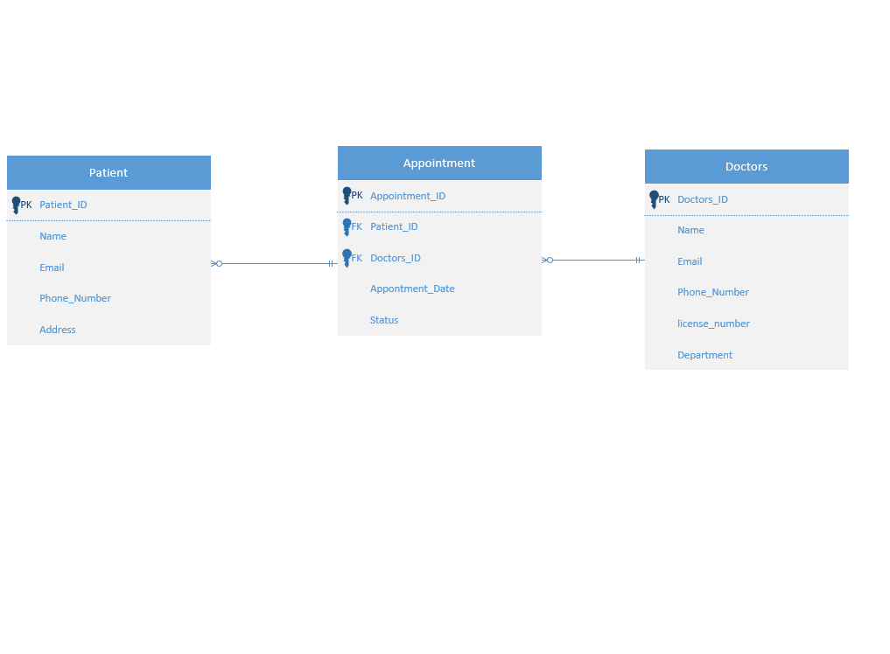

# java2_group10_hospittal_management_api
# Hospital Management System

## Project Overview

This project implements a comprehensive hospital management system that handles patient records, doctor information and appointment scheduling. The system provides complete functionality for managing hospital operations including patient registration, doctor management and appointment booking capabilities.

## System Modules

The application consists of three integrated modules that work together to provide complete hospital management functionality:

### Patient Module
Manages all patient related information and operations including registration, profile updates and patient records maintenance.

### Doctor Module
Handles doctor information management including specialization tracking, department assignments and professional details.

### Appointment Module
Manages appointment scheduling between patients and doctors including booking, rescheduling and appointment status tracking.

## Features Implemented

### Patient Management
* Register new patients with complete personal information
* View and update patient profiles
* Search patient records
* Maintain patient contact details and medical history

### Doctor Management
* Add new doctors to the system
* Track doctor specializations and departments
* Search doctors by specialization or name
* Update doctor professional information
* Remove doctors from the system

### Appointment Scheduling
* Book appointments between patients and doctors
* View appointment schedules
* Track appointment status
* Search appointments by date or doctor
* Cancel or reschedule appointments

## Technology Stack

The application is built using modern Java technologies:

**Backend Framework:** Spring Boot with Spring Data JPA
**Database:** MySQL for data persistence
**API Architecture:** RESTful web services
**Data Format:** JSON for all communications
**Build Tool:** Maven for dependency management

## Database Design

The system uses a relational database design with three main tables:

### Patients Table
Stores patient personal and contact information including name, email, phone and address details.

### Doctors Table
Maintains doctor professional information including name, email, phone, specialization, license number and department.

### Appointments Table
Manages appointment scheduling with patient and doctor references, appointment dates, times and status tracking.

## API Endpoints

### Patient Endpoints
**POST /api/patients** - Create new patient
**GET /api/patients** - List all patients
**GET /api/patients/{id}** - Get specific patient
**PUT /api/patients/{id}** - Update patient information
**DELETE /api/patients/{id}** - Remove patient

### Doctor Endpoints
**POST /api/doctors** - Create new doctor
**GET /api/doctors** - List all doctors
**GET /api/doctors/{id}** - Get specific doctor
**GET /api/doctors/specialization/{specialization}** - Find doctors by specialty
**GET /api/doctors/department/{department}** - Find doctors by department
**GET /api/doctors/search/{name}** - Search doctors by name
**PUT /api/doctors/{id}** - Update doctor information
**DELETE /api/doctors/{id}** - Remove doctor

### Appointment Endpoints
**POST /api/appointments** - Create new appointment
**GET /api/appointments** - List all appointments
**GET /api/appointments/{id}** - Get specific appointment
**GET /api/appointments/patient/{patientId}** - Get patient appointments
**GET /api/appointments/doctor/{doctorId}** - Get doctor appointments
**GET /api/appointments/date/{date}** - Get appointments by date
**PUT /api/appointments/{id}** - Update appointment
**DELETE /api/appointments/{id}** - Cancel appointment

## System Architecture

The application follows the Model View Controller architecture pattern:

**Model Layer:** Defines entities and database mapping
**Repository Layer:** Handles database operations
**Service Layer:** Implements business logic
**Controller Layer:** Manages HTTP requests and responses

## Installation and Setup

1. Install MySQL database server
2. Create hospital database
3. Configure database connection in application properties
4. Install Java 17 or higher
5. Install Maven build tool
6. Clone the project repository
7. Run mvn spring-boot:run to start the application
8. Access APIs at http://localhost:8081

## Testing

The system has been thoroughly tested using Postman with comprehensive test suites covering:
* All CRUD operations for each module
* Search and filter functionality
* Data validation and error handling
* Integration between modules
* Edge cases and error scenarios

## Usage Examples

### Creating a Patient
Send POST request to /api/patients with patient details

### Booking an Appointment
Send POST request to /api/appointments with patient and doctor IDs

### Finding Specialists
Send GET request to /api/doctors/specialization/Cardiology

### Viewing Patient Appointments
Send GET request to /api/appointments/patient/{patientId}

## System Integration

The three modules work seamlessly together through well defined relationships:
* Patients can book multiple appointments
* Doctors can conduct multiple appointments
* Each appointment links one patient with one doctor
* All modules share the same database and follow consistent API patterns

## Future Enhancements

Potential improvements for the system include:
* User authentication and authorization
* Billing and invoice management
* Medical records and prescription tracking
* Doctor availability and scheduling optimization
* Patient feedback and rating systems
* Mobile application development
* Advanced reporting and analytics

## Contributing

This project was developed as a collaborative effort with separate modules integrated to form a complete hospital management solution. Each module follows consistent coding standards and architectural patterns to ensure maintainability and scalability.

## Contact

For questions, suggestions, or contributions regarding this hospital management system, please refer to the project documentation or contact the development team through the appropriate channels.

**_Hospital Management System - Entity Relationship Diagram
Group 10 - Patient, Doctor & Appointment Modules_**

This Entity Relationship Diagram illustrates the complete database design for our Hospital Management System.
The system integrates three core modules: Patient Management, Doctor Management, and Appointment Scheduling.
The relationships show that one patient can book multiple appointments with different doctors,
and one doctor can conduct multiple appointments with different patients.

## **Team Credits:**

**Baboucarr Nyass** - Doctor Module (Entity Design, REST API Implementation, CRUD Operations)
- ER Database Diagram Creation  
- Comprehensive README and Project Documentation

**Assan Faal** - Patient Module (Entity Design, Database Operations, API Endpoints)
- Appointment Scheduling Module  
- GitHub Repository Manager and Version Control

Group 10 - Computer Programming2 Course Project | January 2024

